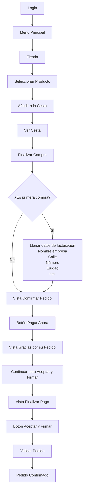
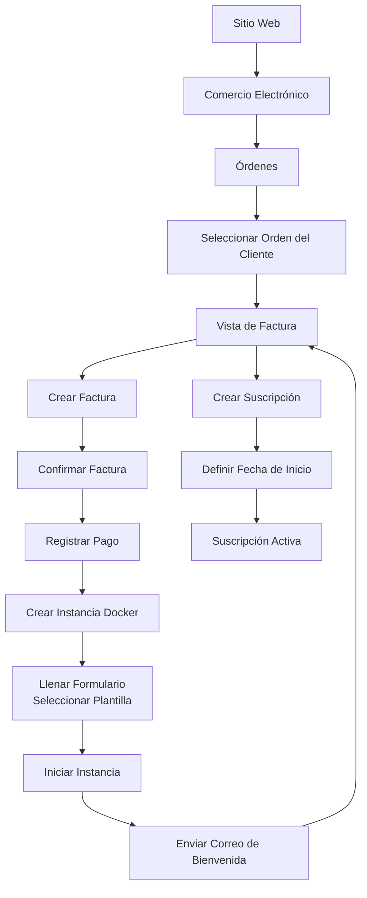
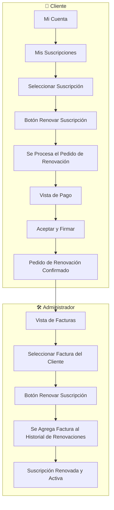

# MicroSaaS - Gestión de Instancias Odoo en Docker

Módulos para Odoo que permiten gestionar instancias Docker de Odoo como un servicio SaaS, integrando la facturación, creación de instancias y suscripciones en un solo flujo automatizado.

---

## 📦 Módulos

### 1. `micro_saas` — Gestión de Instancias Docker

Es el núcleo del sistema. Se encarga de **crear, arrancar, detener y eliminar instancias de Odoo corriendo en contenedores Docker**.

**Responsabilidades:**
- Asignar puertos HTTP y Longpolling disponibles automáticamente
- Generar el archivo `docker-compose.yml` y `odoo.conf` por instancia
- Ejecutar comandos Docker (`up`, `down`, `restart`)
- Activar o pausar la suscripción asociada según el estado de la instancia

**Modelo principal:** `odoo.docker.instance`

**Estados de la instancia:**

| Estado | Descripción |
|--------|-------------|
| `draft` | Recién creada, sin configurar |
| `running` | Contenedor activo |
| `stopped` | Contenedor detenido |
| `error` | Error durante alguna operación |

---

### 2. `crear_instancia_factura` — Facturación → Instancia

Conecta el módulo de facturación nativo de Odoo con el sistema de instancias (Modulo micro_saas). Permite **crear una instancia Docker directamente desde una factura pagada**, prellenando automáticamente los datos del cliente.

**Responsabilidades:**
- Extender `account.move` (facturas) para relacionarlas con instancias
- Validar que la factura sea de cliente y esté completamente pagada antes de crear la instancia
- Redirigir al formulario de creación de instancia con datos prellenados
- Mostrar un contador de instancias por factura
- Permitir navegar a la(s) instancia(s) creadas desde la factura

**Modelo extendido:** `account.move`

---

### 3. `microsaas_subscription` — Suscripciones *(en desarrollo)*

Gestiona el ciclo de vida de las suscripciones asociadas a cada instancia. Se activa automáticamente cuando una instancia pasa a estado `running`.

**Responsabilidades (planeadas):**
- Crear suscripciones en estado `draft` al momento de generar la instancia
- Activar la suscripción con `fecha_inicio = hoy` cuando la instancia arranca
- Controlar fechas de vencimiento mediante un cron job
- Manejar estados: `draft` → `active` → `expiring_soon` → `expired`

**Modelo principal:** `microsaas.subscription`

---

### 4. `micro_saas_correo` — Envío de Correos Transaccionales

Se encarga de gestionar todas las comunicaciones por correo electrónico del sistema MicroSaaS mediante un servidor SMTP configurado. Utiliza plantillas predefinidas para cada evento relevante del ciclo de vida de la instancia y la suscripción.

**Responsabilidades:**
- Configurar y gestionar la conexión con el servidor SMTP
- Enviar correo de **bienvenida** al momento de crear la instancia
- Enviar correo de **instancia levantada** cuando el contenedor pasa a estado `running`
- Enviar correo de **recordatorio de expiración** cuando la suscripción está próxima a vencer

**Plantillas de correo:**

| Plantilla | Evento disparador |
|-----------|-------------------|
| Bienvenida | Creación de la instancia |
| Instancia activa | Estado cambia a `running` |
| Recordatorio de expiración | Suscripción en estado `expiring_soon` |

---

### 5. `restriccion_carrito_un_producto` — Restricción de Un Producto por Compra

Módulo de validación que garantiza que cada factura/orden de compra contenga únicamente una suscripción por producto. Evita que el cliente pueda adquirir más de una unidad del mismo producto suscripción en una misma transacción.

**Responsabilidades:**
- Interceptar la confirmación de la orden o factura antes de procesarla
- Validar que no exista más de una línea con el mismo producto de tipo suscripción
- Lanzar un mensaje de error descriptivo si se detecta duplicidad, bloqueando la operación

**Comportamiento de validación:**

| Situación | Resultado |
|-----------|-----------|
| Una suscripción por compra | ✅ Permitido |
| Más de una unidad del mismo producto | ❌ Error: "Es un producto por compra" |
| Productos distintos en la misma compra | ❌ Error: "Es un producto por compra" |

**Modelo extendido:** `sale.order` / `account.move`

---

### 6. `micro_saas_interfaz_pago` — Interfaz de Pago del Cliente

Módulo de cara al cliente que expone el flujo de pago de forma simplificada. Contiene el botón que redirige directamente a la firma y confirmación dentro del proceso de pago, permitiendo al cliente completar la operación sin navegar por pantallas intermedias innecesarias.

**Responsabilidades:**
- Renderizar el botón de acción de pago en el portal del cliente
- Redirigir directamente al paso de firma dentro de la operación de pago
- Integrarse con el flujo de `account.payment` o el portal de ventas existente

**Modelo extendido:** Portal de cliente / `account.move` (vista cliente)

---

### 7. `micro_saas_traducciones` — Traducciones del Sistema

Módulo auxiliar encargado de centralizar y distribuir las traducciones de la interfaz de usuario para todos los módulos del ecosistema MicroSaaS. Garantiza que las etiquetas, mensajes de error, nombres de campos y textos de vistas estén correctamente localizados al idioma configurado.

**Responsabilidades:**
- Proveer archivos `.po` con las cadenas traducidas para cada módulo del sistema
- Cubrir traducciones de campos, vistas, mensajes de validación y menús
- Mantener consistencia terminológica entre módulos (`instancia`, `suscripción`, `plantilla`, etc.)

**Módulos cubiertos:**

| Módulo | Cobertura |
|--------|-----------|
| `micro_saas` | Campos, vistas, errores y menús |
| `micro_saas_correo` | Plantillas y mensajes de correo |
| `microsaas_subscription` | Estados y mensajes de suscripción |
| `crear_instancia_factura` | Campos y acciones de factura |

**Idiomas soportados:**

| Código | Idioma |
|--------|--------|
| `es` | Español |

---

## 🔄 Flujo General del Sistema

```
1. FACTURA PAGADA (account.move)
        │
        │  Usuario hace clic en "Crear Instancia"
        ▼
2. action_crear_instancia()
        │  ✅ Valida: es factura de cliente
        │  ✅ Valida: está pagada (payment_state = 'paid')
        │  ✅ Valida: tiene partner
        │
        │  Redirige al formulario de odoo.docker.instance
        │  Pre-llenando: partner_id, factura_id, name
        ▼
3. FORMULARIO DE INSTANCIA (odoo.docker.instance)
        │  Usuario configura template, repositorios, puertos
        │  (los puertos se asignan automáticos por onchange_name)
        ▼
4. start_instance()
        │  Crea docker-compose.yml
        │  Clona repositorios
        │  Crea odoo.conf
        │  Levanta contenedores
        │  state = 'running'
        ▼
5. _activar_suscripcion()
        │  Busca microsaas.subscription en draft
        │  La activa con fecha_inicio = hoy
        ▼
6. DE VUELTA EN LA FACTURA
        │  instancia_count sube a 1
        │  Botón "Ver Instancias" aparece disponible
        ▼
7. action_ver_instancias()
           Si hay 1 → abre el form directo
           Si hay varias → muestra lista filtrada
```

---

## 🗂️ Estructura del Proyecto

```
addons/
├── micro_saas/                    # Gestión de instancias Docker
│   ├── models/
│   │   └── odoo_docker_instance.py
│   └── ...
├── crear_instancia_factura/       # Relación Factura ↔ Instancia
│   ├── models/
│   │   └── account_move.py
│   └── ...
└── microsaas_subscription/        # Suscripciones (en desarrollo)
    ├── models/
    │   └── microsaas_subscription.py
    └── ...
```

---

## 🔗 Relaciones entre Módulos

```
account.move (Factura)
    │
    │  factura_id (Many2one)
    ▼
odoo.docker.instance (Instancia)
    │
    │  instancia_id (Many2one)
    ▼
microsaas.subscription (Suscripción)
```

- Una **factura** puede generar una o más **instancias**
- Cada **instancia** tiene una **suscripción** asociada que se activa al arrancar

---


## Diagrama de flujo proceso de compra de suscripción (cliente)



## Diagrama de flujo proceso de verificar un pedido , levantar instancia de docker + suscripción (Administrador)



## Diagrama de flujo proceso de Renovación de Suscripción


## ⚠️ Notas Importantes

- El módulo `microsaas_subscription` debe tener una suscripción en estado `draft` creada y vinculada a la instancia **antes** de ejecutar `start_instance()`, de lo contrario `_activar_suscripcion()` no encontrará nada que activar.
- Los puertos se verifican dos veces: primero contra los ya registrados en la base de datos, luego mediante un `bind` real en el socket del sistema.
- El log de cada instancia se limpia automáticamente si supera los 10,000 caracteres.